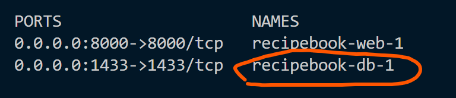

### Running the code
After cloning the repository to your desired path, open up a terminal at the cloned directory.

It should look something like "C:\\...\trojan>"

#### terminal 1
run `cd .\recipebook\`
followed by `docker-compose up --build` (make sure you have docker/docker desktop up). This will run and install necessary modules for backend and database. Let it run for a bit and do not touch this, once it stops printing move onto the next step

#### terminal 2
run `docker ps -a` and confirm that it has the same name

if the same, we run `docker exec -it recipebook-db-1 "bash"`
once inside bash, run `/bin/bash /init_db.sh` to initialize the database

### how to access 
- opening up this link http://localhost:8000/ will redirect you to the testing dashboard
- mssql is accessible at localhost port 1433
- one of the requirement was recipes/, you could visit it here http://localhost:8000/recipes/ 

